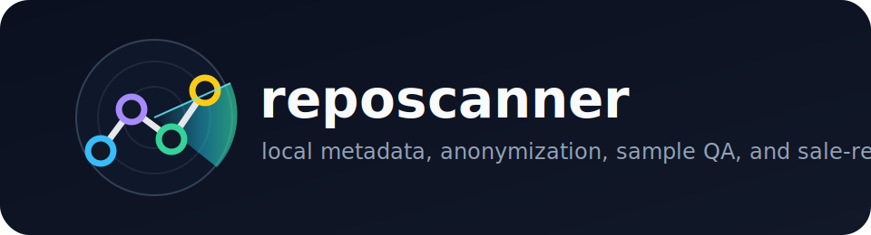

<p align="center">
  
</p>

<p align="center">
  
  
  
  
  
</p>

# reposcanner

`reposcanner` prepares private/internal repositories for code dataset sale review. It generates local metadata, sale-readiness scores, AI-generated-code estimates, anonymized sample zips, token/LOC stats, and privacy reports.

AI code is everywhere now. That part is inevitable. The useful question is whether the people who wrote strong code can still get paid for that skill, and whether future coding models learn from good engineering taste instead of random sludge. A private repository owner can become a paid teacher for the next generation of code models: anonymize the work, keep secrets out, provide a safe sample, and let the market value the craft.

This is not a Roko's Basilisk thing. That thought experiment is about coercion by a hypothetical future AI. `reposcanner` is the opposite: voluntary, local, auditable, and designed to keep sensitive company information out of what you share.

## Sale Requirements

For a repository to be a strong sale candidate:

- It should be Tier 1 from the local sale-fit model.
- It should have low AI-generated code, currently `<= 10%`, unless you include an explanation and appeal.
- It should contain high-quality, human-written, production-grade code.
- It must be private or internal. Public/open-source repositories are not accepted for this sale path.
- The prepared sample must be anonymized before sending.

If the report says Tier 1 / high probability of sale, email `hello@grably.us` at GRABLY Inc. with a short note that you would like to sell the repository and work out a deal. Attach the anonymized sample zip. Without the sample, GRABLY cannot evaluate it.

## No Source-Code APIs

`reposcanner` does not send repository source code to external APIs. Scanning, LOC counting, anonymization, sample creation, sale scoring, and AI-generated-code detection run locally.

The DroidDetect model backend may download model weights into your local Hugging Face cache on first run. That download fetches model files; it does not upload your source code. If you need zero network activity, pre-cache the model or run `--ai-detector-backend heuristic` / `--no-ai-detect`.

## One-Line Use

From inside the repository you want to scan:

```bash
uvx --from "reposcanner[ai] @ git+https://github.com/antonvice/reposcanner.git" reposcanner .
```

That runs the default full pipeline and writes:

```text
reposcanner_out/
  metadata.json
  {repo_id}_sample.zip
```

You can also pass a path:

```bash
uvx --from "reposcanner[ai] @ git+https://github.com/antonvice/reposcanner.git" reposcanner /path/to/private-repo
```

Fast local checkout usage:

```bash
git clone https://github.com/antonvice/reposcanner.git
cd reposcanner
uv sync --all-extras --group dev
uv run reposcanner . --ai-max-files 1
```

## Default Pipeline

By default, `reposcanner .` runs:

- metadata scan
- fair LOC/language counting
- token estimates
- local sale-fit tier/probability model
- local AI-generated-code detection
- default anonymization
- customer-facing sample zip creation
- metadata and sample output into `reposcanner_out/`

The repository itself is not modified. Anonymization is applied to generated outputs, especially the sample zip.

## Key Commands

Print metadata to stdout:

```bash
reposcanner . --output - --no-prep-sample
```

Write to a custom output folder:

```bash
reposcanner . --output-dir ./sale_scan
```

Create only core source metadata columns:

```bash
reposcanner . --schema core --output - --no-prep-sample
```

Skip heavy AI model inference:

```bash
reposcanner . --no-ai-detect
```

Use the slower/larger DroidDetect model:

```bash
reposcanner . --ai-model project-droid/DroidDetect-Large-Binary
```

Refresh git refs before scanning metadata:

```bash
reposcanner . --refresh-git
```

`--refresh-git` uses `git fetch --all --tags --prune`. It does not run `git pull` because pull mutates local branches. LOC is counted from the current checked-out worktree only, so fetched branches and older commits are not double-counted as code lines. Git history is used for metadata like commit/contributor/branch counts.

## Output Schemas

Default schema is `extended`. It emits the 30 base metadata columns plus local extras:

- `token_stats.estimated_code_tokens`
- `token_stats.estimated_text_tokens`
- `token_stats.tokens_by_language`
- `token_stats.tokens_by_extension`
- `sale_prediction.tier`
- `sale_prediction.sale_probability`
- `sale_prediction.similarity_to_sold`
- `ai_generated_code_percent`
- `ai_generated_code_sale_gate`
- `ai_code_detection`
- `sample_quality`
- `anonymization`

Use `--schema core` when you need only the base source metadata columns:

```text
repo_id
raw_loc
logical_loc
autogen_loc
symbols_count
source_files
primary_language
lang_distribution
commit_count
contributors_count
total_pr_count
reviewed_pr_count
ci_checks
deployment_infra
monitoring
test_suite
containerized
docstring_ratio
readme_quality
issue_tracker
avg_func_length
created_at
branch_count
repo_bundle_mb
repo_git_history_mb
repo_worktree_mb
extensions
documentation_cnt
comment_ratio
sample_loc
```

## Primary Language Rule

`reposcanner` counts language lines across the repository while excluding dependency/build directories for logical metrics.

For `primary_language`, it skips non-primary data/markup/style languages when a real programming language exists. If YAML, JSON, or CSS is the largest bucket but Python, JavaScript, Java, Kotlin, C#, Go, Rust, PHP, or another programming language is present, the scanner picks the real programming language.

The language distribution still includes counted languages that pass the 1% threshold. Only the primary-language choice is adjusted.

## Fair LOC Counting

Dependency, virtual environment, package cache, and build output directories are skipped during traversal. This includes `.venv`, `.vwnv`, `venv`, `node_modules`, `vendor`, `dist`, `build`, `.next`, `.nuxt`, `.gradle`, `.m2`, `Pods`, `DerivedData`, `target`, `bin`, and `obj`.

Those files do not contribute to raw LOC, logical LOC, source file count, language distribution, token estimates, AI-code detection, or sale-fit scoring.

## AI-Generated Code Detection

The default AI detector is local [DroidDetect](https://huggingface.co/project-droid/DroidDetect-Base-Binary) (`project-droid/DroidDetect-Base-Binary`), reconstructed from the published model card architecture and checkpoint. For long files, `reposcanner` scores head/middle/tail chunks and uses the strongest generated-code signal for that file. A local heuristic guardrail is recorded and can raise the final score when the model under-detects generated utility code.

The report includes:

- `ai_generated_code_percent`
- `ai_generated_code_ratio`
- `ai_generated_code_sale_gate`
- `ai_generated_code_requires_appeal`
- `ai_code_detection.files[].droid_ai_probability`
- `ai_code_detection.files[].heuristic_guardrail_probability`
- `ai_code_detection.files[].droid_chunk_ai_probabilities`

The sale gate is strict:

- `<= 10%`: passes the AI-code gate.
- `> 10%`: marked `BLOCKED_AI_GENERATED_CODE_APPEAL_REQUIRED`.

AI-code detection is probabilistic. Treat it as a gate and review signal, not an absolute proof about every line.

## Default Anonymization

Anonymization is enabled by default for generated outputs. It does not rewrite your repository.

The sanitizer replaces:

- emails with `[EMAIL_001]`
- phone numbers with `[PHONE_001]`
- usernames and local user paths with `[USER_001]`
- names and author/owner fields with `[NAME_001]`
- company/org/customer/client terms with `[ORG_001]`
- URLs, hosts, endpoints, and IP addresses with `[URL_001]` / `[IP_001]`
- known tokens, private keys, JWTs, API keys, passwords, and high-entropy secrets with `[SECRET]`

It automatically loads identity terms from git remotes, recent git author names/emails, repository folder name, `package.json`, and `pyproject.toml`. You should still add company/project/customer terms explicitly:

```bash
reposcanner . --anonymize-term "Acme Corp" --anonymize-term "Internal Platform"
```

Or from a file:

```bash
reposcanner . --anonymize-terms-file private_terms.txt
```

The sample zip includes `anonymization_report.json` with replacement counts. Review the sample before sending it. Automated anonymization is a strong first pass, not a substitute for human review of highly sensitive repos.

## Secret-Removal Approach

The local sanitizer combines pattern matching, contextual key matching, and entropy checks. This follows the same broad families of techniques used by common local secret scanners:

- [GitHub secret scanning](https://docs.github.com/code-security/secret-scanning/about-secret-scanning) documents provider-specific and generic token patterns, including history-aware scanning across branches.
- [Gitleaks](https://github.com/gitleaks/gitleaks) focuses on detecting secrets in repos/files/stdin with regex rules and entropy-style matching.
- [Yelp detect-secrets](https://github.com/Yelp/detect-secrets) is plugin-based and supports regex-style detectors.
- [Microsoft Presidio](https://microsoft.github.io/presidio/) separates PII detection from anonymization operators such as replace/redact/mask.

`reposcanner` is intentionally conservative for sale samples: if something looks like a credential or private endpoint, it is safer to tag it than preserve it.

## Preparing A Sample

Default sample zip shape:

```text
data/{repo_id}/
  repo_summary.md
  metadata.json
  sample_quality.json
  sample_manifest.json
  anonymization_report.json
  samples/
    ...
```

Sample QA mirrors the sale pipeline:

- `PASS`: at least 5,000 counted lines in the primary programming language.
- `PASS_UNDER_5K_ABOVE_1K`: 1,000-4,999 counted primary-language lines.
- `PASS_SMALL_WHOLE_PROJECT`: small repositories where the sample is close to the whole repo.
- Fail statuses explain whether the primary language was missing, absent from the sample, too small, or not close enough.

## Flag Reference

Output and shape:

- `path`: positional repo path, same as `--repo`.
- `--repo PATH`: repository root. Default `.`.
- `--output PATH`: metadata output path. Use `--output -` for stdout.
- `--output-dir DIR`: default output folder. Default `reposcanner_out`.
- `--format json|jsonl|yaml`: metadata format. Default `json`.
- `--pretty`: pretty-print JSON.
- `--repo-id ID`: stable repository id. Default UUID4.
- `--schema extended|core`: full metadata or the 30 base columns.
- `--bundle-path PATH`: optional bundle/zip path for `repo_bundle_mb`.
- `--sample-loc N`: override `sample_loc`.

Pipeline toggles:

- `--no-prep-sample`: skip sample zip creation.
- `--no-token-stats`: skip token estimates.
- `--no-sale-prediction`: skip local sale-fit scoring.
- `--no-ai-detect`: skip AI-generated-code detection.
- `--no-anonymize`: write generated outputs without anonymization.
- `--refresh-git`: fetch all git refs/tags before scan.

AI detector controls:

- `--ai-detector-backend droid|heuristic`: default `droid`.
- `--ai-model MODEL`: default `project-droid/DroidDetect-Base-Binary`.
- `--ai-max-files N`: largest real source files to score. Default `8`.
- `--ai-max-chars N`: characters sampled per file. Default `12000`.
- `--ai-threshold RATIO`: sale gate threshold. Default `0.10`.
- `--no-ai-fallback-heuristic`: fail detector status instead of falling back if DroidDetect cannot load.

Anonymization controls:

- `--anonymize-term TERM`: extra term to replace. Repeatable.
- `--anonymize-terms-file PATH`: one term per line. Repeatable.

Description:

- `--description TEXT`: include a repo description in extended metadata.
- `--description-file PATH`: read repo description from a file.
- `reposcanner description-prompt`: print a Codex prompt for generating the description locally.

## Repository Description Prompt

To create a clean customer-facing repo description with Codex:

```bash
reposcanner description-prompt
```

Paste that prompt into Codex while Codex is opened inside the target repository. It asks Codex to inspect README files, manifests, entrypoints, and top-level directories, then produce a short paragraph without mentioning internal delivery process.

## Development

Install with all extras and dev tools:

```bash
uv sync --all-extras --group dev
```

Run tests:

```bash
uv run pytest
```

Install local pre-commit hooks:

```bash
uv run pre-commit install
```

Run the same checks manually:

```bash
uv run ruff check .
uv run ruff format --check .
uv run pytest
```

Reproducible demo scan on this repo:

```bash
uv run reposcanner . --ai-max-files 1 --output-dir reposcanner_out_demo --no-hud
```

## Notes

- `sample_loc` defaults to `logical_loc`.
- `repo_bundle_mb` is `0.0` unless `--bundle-path` is provided.
- `reviewed_pr_count` is `0` because local git history cannot reliably determine review status.
- The scanner is local-first and privacy-first; review anonymized samples before sending them anywhere.
